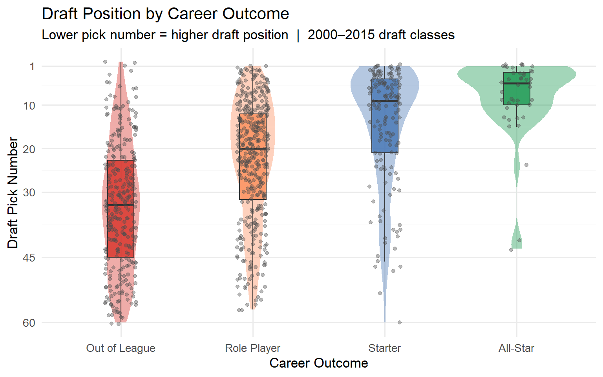
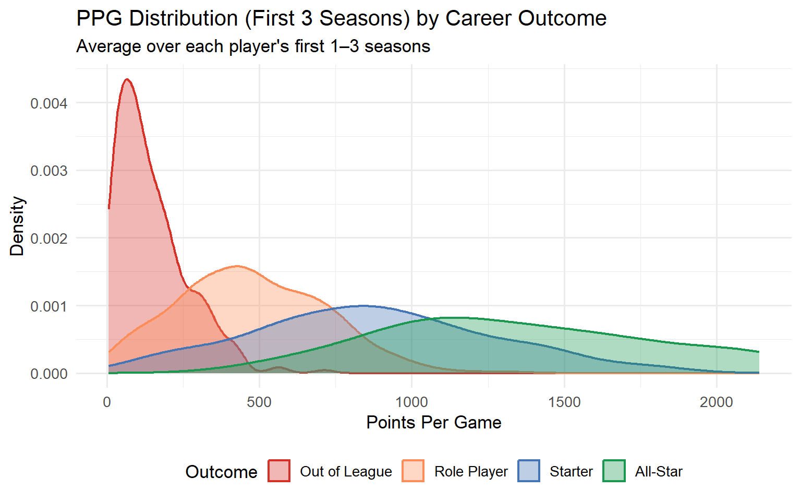
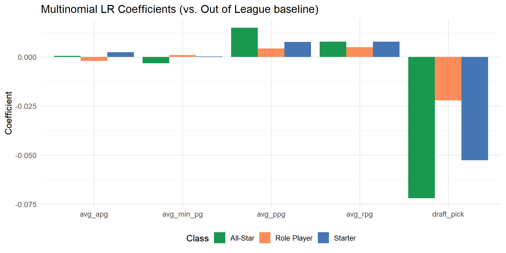
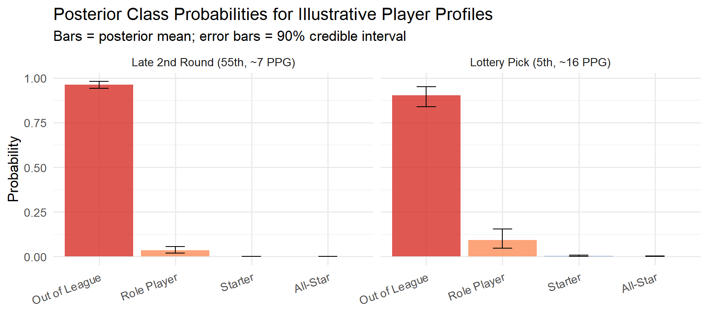
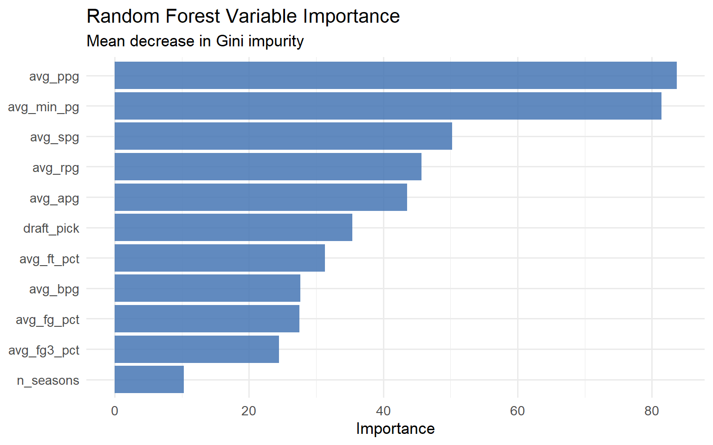

# Abstract

We study a sports question that is more specific than generic player prediction: among highly drafted NBA players, why do some become flops while others justify or exceed draft expectations? We use public NBA data accessed through `hoopR`, combine early-career box score statistics with draft information, and model longer-run career outcomes using four tiers: `Out of League`, `Role Player`, `Starter`, and `All-Star`. This outcome structure lets us study draft failure without reducing the problem to a crude bust-or-not binary. JIwon Park fits a multinomial logistic regression, Andy Ouyang fits a Bayesian multinomial model, and Stanley Ouyang fits a random forest benchmark. Preliminary results suggest that early scoring, playing time, and draft position are the strongest signals separating disappointing early picks from players who become reliable starters or stars.

# Introduction

NBA teams do not just care about whether a young player is good in the abstract. They care about whether that player justifies where he was picked. Missing on a high draft pick is one of the most expensive mistakes a front office can make, so the more interesting sports question is not simply who becomes good, but why some highly drafted players still fail.

Our project asks: among highly drafted NBA players, what features from the first one to three NBA seasons separate players who flop from players who meet or exceed draft expectations? We keep the response variable as four career tiers: `Out of League`, `Role Player`, `Starter`, and `All-Star`. This is useful because it preserves more structure than a binary bust label while still matching the real basketball question. A top pick who becomes only a bench player is very different from a top pick who becomes an All-Star, and the model should reflect that.

This is a good sports analytics project because it is clearly motivated by decision-making under uncertainty. It also fits the course well: the outcome is multiclass, the predictors are interpretable, and uncertainty can be quantified in several different ways. Our preliminary takeaway is that early scoring production, early playing time, and draft position are the main variables separating disappointing early picks from players who develop into starters or stars. The three models differ in how they represent that pattern: multinomial logistic regression gives an interpretable baseline, the Bayesian model gives posterior uncertainty, and the random forest provides a flexible nonlinear benchmark.

# Data

We use public NBA player data accessed through `hoopR`. The dataset starts from season-level NBA player statistics from 2000 through 2015, joined with player-level draft information. We then construct player-level predictors using only the first one to three NBA seasons for each player.

The response variable is a four-level career outcome category: `Out of League`, `Role Player`, `Starter`, and `All-Star`. The predictor set includes early-career scoring, rebounding, assists, steals, blocks, shooting percentages, minutes per game, number of observed early seasons, and draft pick. Players with extremely short appearances are filtered out during preprocessing, and the final modeling table uses one row per player.

Although the full modeling table includes a broad set of drafted players, the main interpretation of the project is centered on highly drafted players. We use the broader sample to stabilize the model and preserve enough observations in each outcome tier, but the sports motivation remains the same: understanding why some early picks fail while others justify the investment.

Major preprocessing steps are:

1. Pull and cache season-level NBA player statistics.
2. Keep the first one to three seasons for each player.
3. Average early-career performance variables across those seasons.
4. Join draft information and career outcome labels.
5. Remove players with missing modeling fields.

The EDA below shows why this project is interesting. First, stronger long-run outcomes are clearly associated with earlier draft position, which means expectations are different at the top of the draft. Second, early-career scoring already separates many eventual career paths. Together, these plots motivate the real question of the paper: conditional on being drafted highly, which early signals point toward a flop and which point toward a successful career?

{width=80%}

{width=80%}

# Methods

## Jiwon Park

Jiwon's model is a multinomial logistic regression for the four-level career outcome. Let \(Y_i\) denote the career tier for player \(i\). The model assumes that
$$
P(Y_i = k \mid x_i) = \frac{\exp(\alpha_k + x_i^\top \beta_k)}{\sum_{j=1}^K \exp(\alpha_j + x_i^\top \beta_j)}.
$$
with one category used as the baseline class. This is a natural course-aligned method because the response is multiclass and the model gives direct coefficient-based interpretation. For this project, the model is especially useful because it lets us ask how early-career variables shift the probability that a highly drafted player ends up disappointing versus becoming a starter or star.

The predictors are early-career averages and draft information: `draft_pick`, `avg_ppg`, `avg_rpg`, `avg_apg`, `avg_spg`, `avg_bpg`, `avg_fg_pct`, `avg_fg3_pct`, `avg_ft_pct`, `avg_min_pg`, and `n_seasons`. Model evaluation is based on a held-out train/test split, with comparison through predictive accuracy and confusion-matrix behavior across the four outcome classes.

Uncertainty is quantified with bootstrap confidence intervals for the regression coefficients. This is appropriate here because the main quantities of interest are coefficient directions and magnitudes rather than only one fitted point estimate, especially when comparing players whose early-career profiles are close to the boundary between flop and success.

## Andy Ouyang

Andy's model is a Bayesian multinomial logistic regression. It uses the same multiclass outcome structure, but places priors on model parameters and estimates posterior distributions rather than only point estimates. This is useful for the project because player-outcome prediction is inherently uncertain, especially for players near the boundary between role-player and starter outcomes.

The Bayesian model uses a reduced predictor set to keep computation stable and interpretable: `draft_pick`, `avg_ppg`, `avg_rpg`, `avg_apg`, `avg_min_pg`, and `avg_fg_pct`. Weakly informative normal priors are placed on coefficients and intercepts. Evaluation is based on held-out predictive performance together with posterior class probabilities for illustrative player profiles.

Uncertainty is quantified directly through posterior intervals and posterior predictive probabilities. This is appropriate because the model is designed to propagate uncertainty into the predicted outcome distribution itself.

## Stanley Ouyang

Stanley's model is a random forest classifier. Unlike the logistic models, the random forest does not impose a linear predictor structure. Instead, it builds an ensemble of decision trees to capture nonlinear patterns and interactions among early-career performance variables.

This model is included as a benchmark. It is appropriate because relationships among minutes, scoring, efficiency, and draft position may be nonlinear. Evaluation is based on held-out predictive performance and variable-importance summaries, which show which predictors the model relies on most heavily. In substantive terms, the model checks whether the flop-versus-success question among early picks has nonlinear structure that the regression models miss.

Uncertainty is quantified through out-of-bag error behavior and stability of the variable-importance ranking. This does not give parameter intervals like the regression approaches, but it still provides a defensible way to describe model uncertainty and instability in a flexible prediction setting.

# Results

## Jiwon Park

The multinomial logistic regression serves as the baseline multiclass model. Preliminary coefficient estimates indicate that stronger early scoring and more playing time are positively associated with stronger career outcomes, while worse draft position works in the opposite direction. For the actual sports question, this means that highly drafted players who fail to earn early minutes or produce efficiently are much more likely to slide toward disappointing career outcomes than toward starter or star trajectories.

The bootstrap-based uncertainty summaries are important here because they show that the model should not be interpreted as producing exact coefficient values. Instead, the main result is directional: early scoring, minutes, and draft position repeatedly appear as the strongest predictors separating successful early picks from flops.

{width=82%}

## Andy Ouyang

The Bayesian multinomial model produces similar substantive conclusions, but with a more direct representation of predictive uncertainty. Rather than only assigning one class to a player, the model returns a distribution over possible career outcomes. That is valuable for this project because many highly drafted players are borderline cases early on rather than obvious stars or obvious flops.

The preliminary profile comparison shows that a high-producing lottery pick has much more posterior mass on `Starter` and `All-Star`, while a modest low-pick profile has much more posterior mass on `Out of League` and `Role Player`. The uncertainty intervals around these probabilities are part of the result, not an afterthought, because the entire point of the project is that draft success and failure are uncertain early in a player's career.

{width=82%}

## Stanley Ouyang

The random forest gives a flexible benchmark and broadly agrees with the regression-based models about which inputs matter most. Variable importance suggests that early scoring, playing time, and draft position are again central. This consistency is useful because it suggests that the main project conclusions about flop risk among early picks are not driven by only one modeling choice.

At the same time, the random forest is less interpretable than the regression models. Its main contribution is comparative: it helps us check whether nonlinear structure adds clear predictive value beyond the simpler multiclass regression approaches.

{width=82%}

# Discussion

The main conclusion of the draft is that early-career NBA production contains useful information about whether a highly drafted player will justify the pick. Across all three models, the most consistent signals are early scoring, early minutes, and where the player was selected in the draft. Put differently, draft position alone does not determine success. What happens in the first one to three seasons still meaningfully separates high picks who flop from high picks who become reliable starters or stars.

The main limitation of the current draft is the construction of the career outcome labels. Before the final submission, we need to make those labels sharper and easier to defend, especially because the project is really about draft expectations and disappointment. A second limitation is that this draft currently emphasizes preliminary interpretation more than a full model-comparison table. The final report should include a compact comparison of predictive performance across all three approaches.

The next steps are straightforward. First, finalize and justify the outcome labels in a way that better matches the idea of a draft flop. Second, present a cleaner side-by-side evaluation summary for all three models. Third, tighten the uncertainty discussion so that each individual's results subsection directly connects uncertainty to the question of draft success and failure rather than treating it as a technical add-on.
